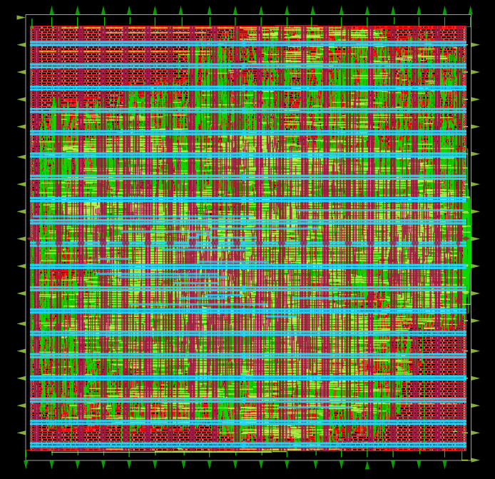
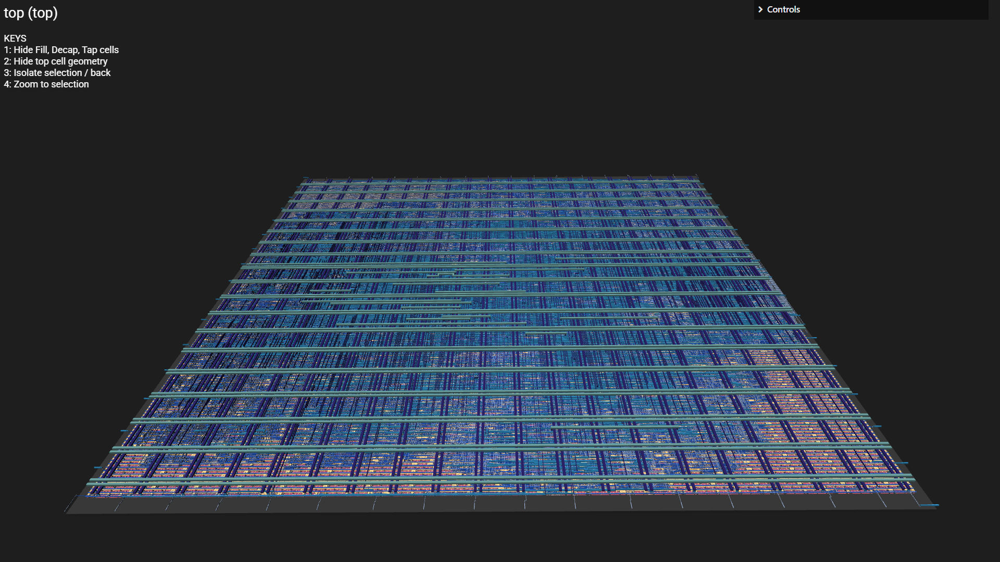

# ChipInventor RVBL-2 Multicycle RISC-V Processor Core
### ChampionCHIP eXperience — Phase 2 Design Challenge

---

## Team & Project Acknowledgments

### **Equipe 15**
| Team Member Name |
| :--- |
| **Ahmed Izzat Sidahmed Ali Tahir** |
| **Ng Kah Lok** |
| **Gan Shao Hng** |
| **Jolin Tan** |
| **Fatin Nuralya Binti Mohamad** |

> **Special Acknowledgments:**  
> We extend our sincere gratitude to the **ChampionCHIP eXperience** organizing committee, mentors, and the **ChipInventor** platform team for providing the design challenge framework, EDA tools, and technical guidance. This project synthesizes foundational single-cycle processor design into a tapeout-ready, multicycle RISC-V core realized on the open-source **SkyWater 130nm (Sky130)** PDK.

---

## 1.0 Project Overview

### 1.1 Project Goal
The **RVBL-2** core is a 32-bit multicycle RISC-V processor developed as part of the **ChampionCHIP eXperience Phase 2 Design Challenge**. Designed for physical ASIC implementation on the **Sky130 130nm PDK** using the **OpenLane** flow, the core optimizes silicon area and resource efficiency by reusing hardware functional units across discrete execution clock cycles.

### 1.2 Architecture
The RVBL-2 core is governed by a **Finite State Machine (FSM)** multicycle control unit that sequences each instruction through distinct temporal phases:
- **Fetch (IF):** Reads the 32-bit instruction word from instruction memory (ROM @ `0x00400000`) and latches it into the Instruction Register (`IR`).
- **Decode (ID):** Extracts the opcode, funct3, and funct7 fields, accesses register file operands `rs1` and `rs2`, and sign/zero-extends immediate constants.
- **Execute (EX):** Activates the designated computational unit (ALU, Multiplier, CRC unit, or Branch Comparator) or computes the memory effective address.
- **Memory Access (MEM):** Interacts with synchronous Data Memory (`DMEM` @ `0x10010000`) for load and store operations. Non-memory instructions bypass this state.
- **Write Back (WB):** Commits the final result (ALU output, multiplier product, CRC remainder, or memory read word) to the destination register `rd` in the Register File, and advances the Program Counter (`PC`).

Multi-cycle iterative operations—such as the sequential shift-and-add hardware multiplier—incorporate dedicated wait states to ensure proper handshaking (`start_i`, `busy_o`, `done_o`) before transitioning to Write Back.

---

## 2.0 Supported Instructions & ISA Coverage

The RVBL-2 core implements **47 instructions** achieving **100% coverage** across all specified competition categories:

### 2.1 ISA Coverage Table
| Category | Expected Instructions | Implemented Instructions | Coverage (%) |
| :--- | :---: | :---: | :---: |
| **Arithmetic & Logic (Register)** | 10 | 10 | **100%** |
| **Arithmetic & Logic (Immediate)** | 9 | 9 | **100%** |
| **Load Instructions** | 5 | 5 | **100%** |
| **Store Instructions** | 3 | 3 | **100%** |
| **Branch Instructions** | 6 | 6 | **100%** |
| **Jump Instructions** | 2 | 2 | **100%** |
| **Upper Immediate Instructions** | 2 | 2 | **100%** |
| **System / Synchronization** | 3 | 3 | **100%** |
| **Multiplication (Zmmul Extension)** | 4 | 4 | **100%** |
| **CRC Computation (Custom Xicrc)** | 3 | 3 | **100%** |
| **Total** | **47** | **47** | **100%** |

### 2.2 Instruction Encoding & FSM Execution Table
| # | Category | Instruction | Opcode | Funct3 | Funct7 | FSM Path / Execution |
| :-: | :--- | :--- | :-: | :-: | :-: | :--- |
| 1 | R-Type Arith/Logic | `ADD` | `0110011` | `000` | `0000000` | FETCH → DECODE → EX_ALU → WB |
| 2 | R-Type Arith/Logic | `SUB` | `0110011` | `000` | `0100000` | FETCH → DECODE → EX_ALU → WB |
| 3 | R-Type Arith/Logic | `SLL` | `0110011` | `001` | `0000000` | FETCH → DECODE → EX_ALU → WB |
| 4 | R-Type Arith/Logic | `SLT` | `0110011` | `010` | `0000000` | FETCH → DECODE → EX_ALU → WB |
| 5 | R-Type Arith/Logic | `SLTU` | `0110011` | `011` | `0000000` | FETCH → DECODE → EX_ALU → WB |
| 6 | R-Type Arith/Logic | `XOR` | `0110011` | `100` | `0000000` | FETCH → DECODE → EX_ALU → WB |
| 7 | R-Type Arith/Logic | `SRL` | `0110011` | `101` | `0000000` | FETCH → DECODE → EX_ALU → WB |
| 8 | R-Type Arith/Logic | `SRA` | `0110011` | `101` | `0100000` | FETCH → DECODE → EX_ALU → WB |
| 9 | R-Type Arith/Logic | `OR` | `0110011` | `110` | `0000000` | FETCH → DECODE → EX_ALU → WB |
| 10 | R-Type Arith/Logic | `AND` | `0110011` | `111` | `0000000` | FETCH → DECODE → EX_ALU → WB |
| 11 | I-Type Arith/Logic | `ADDI` | `0010011` | `000` | — | FETCH → DECODE → EX_ALU → WB |
| 12 | I-Type Arith/Logic | `SLTI` | `0010011` | `010` | — | FETCH → DECODE → EX_ALU → WB |
| 13 | I-Type Arith/Logic | `SLTIU` | `0010011` | `011` | — | FETCH → DECODE → EX_ALU → WB |
| 14 | I-Type Arith/Logic | `XORI` | `0010011` | `100` | — | FETCH → DECODE → EX_ALU → WB |
| 15 | I-Type Arith/Logic | `ORI` | `0010011` | `110` | — | FETCH → DECODE → EX_ALU → WB |
| 16 | I-Type Arith/Logic | `ANDI` | `0010011` | `111` | — | FETCH → DECODE → EX_ALU → WB |
| 17 | I-Type Shift | `SLLI` | `0010011` | `001` | `0000000` | FETCH → DECODE → EX_ALU → WB |
| 18 | I-Type Shift | `SRLI` | `0010011` | `101` | `0000000` | FETCH → DECODE → EX_ALU → WB |
| 19 | I-Type Shift | `SRAI` | `0010011` | `101` | `0100000` | FETCH → DECODE → EX_ALU → WB |
| 20 | Load | `LB` | `0000011` | `000` | — | FETCH → DECODE → EX_MEMADR → MEM_READ → WB |
| 21 | Load | `LH` | `0000011` | `001` | — | FETCH → DECODE → EX_MEMADR → MEM_READ → WB |
| 22 | Load | `LW` | `0000011` | `010` | — | FETCH → DECODE → EX_MEMADR → MEM_READ → WB |
| 23 | Load | `LBU` | `0000011` | `100` | — | FETCH → DECODE → EX_MEMADR → MEM_READ → WB |
| 24 | Load | `LHU` | `0000011` | `101` | — | FETCH → DECODE → EX_MEMADR → MEM_READ → WB |
| 25 | Store | `SB` | `0100011` | `000` | — | FETCH → DECODE → EX_MEMADR → MEM_WRITE → FETCH |
| 26 | Store | `SH` | `0100011` | `001` | — | FETCH → DECODE → EX_MEMADR → MEM_WRITE → FETCH |
| 27 | Store | `SW` | `0100011` | `010` | — | FETCH → DECODE → EX_MEMADR → MEM_WRITE → FETCH |
| 28 | Branch | `BEQ` | `1100011` | `000` | — | FETCH → DECODE → EX_BRANCH → FETCH |
| 29 | Branch | `BNE` | `1100011` | `001` | — | FETCH → DECODE → EX_BRANCH → FETCH |
| 30 | Branch | `BLT` | `1100011` | `100` | — | FETCH → DECODE → EX_BRANCH → FETCH |
| 31 | Branch | `BGE` | `1100011` | `101` | — | FETCH → DECODE → EX_BRANCH → FETCH |
| 32 | Branch | `BLTU` | `1100011` | `110` | — | FETCH → DECODE → EX_BRANCH → FETCH |
| 33 | Branch | `BGEU` | `1100011` | `111` | — | FETCH → DECODE → EX_BRANCH → FETCH |
| 34 | Jump | `JAL` | `1101111` | — | — | FETCH → DECODE → EX_JAL → WB |
| 35 | Jump | `JALR` | `1100111` | `000` | — | FETCH → DECODE → EX_JALR → WB |
| 36 | Upper Immediate | `LUI` | `0110111` | — | — | FETCH → DECODE → EX_LUI_AUIPC → WB |
| 37 | Upper Immediate | `AUIPC` | `0010111` | — | — | FETCH → DECODE → EX_LUI_AUIPC → WB |
| 38 | System | `ECALL` | `1110011` | `000` | `imm=0` | FETCH → DECODE → EX_SYSTEM → FETCH |
| 39 | System | `EBREAK` | `1110011` | `000` | `imm=1` | FETCH → DECODE → EX_SYSTEM → FETCH |
| 40 | System | `FENCE` | `0001111` | `000` | — | FETCH → DECODE → EX_SYSTEM → FETCH |
| 41 | Multiply (Zmmul) | `MUL` | `0110011` | `000` | `0000001` | FETCH → DECODE → EX_MULT → WAIT_MULT → WB |
| 42 | Multiply (Zmmul) | `MULH` | `0110011` | `001` | `0000001` | FETCH → DECODE → EX_MULT → WAIT_MULT → WB |
| 43 | Multiply (Zmmul) | `MULHSU` | `0110011` | `010` | `0000001` | FETCH → DECODE → EX_MULT → WAIT_MULT → WB |
| 44 | Multiply (Zmmul) | `MULHU` | `0110011` | `011` | `0000001` | FETCH → DECODE → EX_MULT → WAIT_MULT → WB |
| 45 | Custom CRC (Xicrc) | `CRCB` | `0110011` | `000` | `1000000` | FETCH → DECODE → EX_CRC → WB |
| 46 | Custom CRC (Xicrc) | `CRCH` | `0110011` | `001` | `1000000` | FETCH → DECODE → EX_CRC → WB |
| 47 | Custom CRC (Xicrc) | `CRCW` | `0110011` | `010` | `1000000` | FETCH → DECODE → EX_CRC → WB |

---

## 3.0 Datapath & Memory Architecture

### 3.1 Memory Map
| Subsystem | Base Address | Size | Function / Type |
| :--- | :---: | :---: | :--- |
| **Instruction Memory (IMEM)** | `0x00400000` | Up to 4 MB | ROM storing instructions & firmware constants |
| **Data Memory (DMEM)** | `0x10010000` | 8 KB (2048 words) | Synchronous SRAM storing `.data`, `.bss`, heap & stack |

### 3.2 Address Decoder & Unified Memory
Core memory access is mediated through a single Address Decoder (`RISCV_ADDR_DECODER`):
- Any memory access with `address[31:16] == 16'h1001` is mapped to **DMEM**.
- Any access to `0x00400000` is mapped to **IMEM**.
- An output multiplexer (`MUX2_32`) selects between ROM and RAM read data, providing a unified memory bus to the CPU.

### 3.3 Load-Store Unit (LSU)
The LSU performs sub-word alignment and sign/zero extension:
- **Store Operations:** Determines the active byte lanes from the two lowest address bits (`addr[1:0]`) and generates the 4-bit write mask (`byte_write_i` = `0001`, `0010`, `0100`, `1000` for `SB`; `0011`, `1100` for `SH`; `1111` for `SW`).
- **Load Operations:** Selects the corresponding byte/halfword slice and applies two's complement sign extension (`LB`, `LH`) or zero-filling (`LBU`, `LHU`). Full word loads (`LW`) pass through transparently.

---

## 4.0 Repository Structure

```
riscv32_multicycle/
├── .github/workflows/              # GitHub Actions CI automated simulation workflows
├── .gitignore                      # Git exclusion rules for simulation dumps & temp files
├── CITATION.cff                    # Academic & project citation metadata
├── LICENSE                         # Apache License 2.0
├── config.json                     # OpenLane flow physical configuration (Sky130)
├── README.md                       # Comprehensive design, signoff & verification documentation
├── design/
│   ├── alu/
│   │   ├── rtl/
│   │   │   ├── alu.v               # 11-operation 32-bit ALU core
│   │   │   └── stage2_alu.v        # STAGE2_ALU wrapper
│   │   └── testbench/
│   │       └── tb_alu.v            # ALU operations testbench
│   ├── branch/
│   │   ├── rtl/
│   │   │   ├── branch_comparator.v # Branch condition evaluator (BEQ, BNE, BLT, etc.)
│   │   │   └── stage2_branch_comparator.v # STAGE2_BRANCH_COMPARATOR wrapper
│   │   └── testbench/
│   │       └── tb_branch_comparator.v # Branch condition testbench
│   ├── control_unit/
│   │   ├── rtl/
│   │   │   └── control_unit.v     # Multicycle FSM control unit
│   │   └── testbench/
│   │       └── tb_control_unit.v   # Multicycle FSM state transition testbench
│   ├── crc/
│   │   ├── rtl/
│   │   │   ├── crc8_block.v        # Custom CRC8 computation (poly 0x1021)
│   │   │   ├── crc16_block.v       # Custom CRC16 computation
│   │   │   ├── crc32_block.v       # Custom CRC32 computation
│   │   │   ├── crc_unit_mux.v      # CRC operation multiplexer
│   │   │   └── stage2_crc.v        # STAGE2_CRC wrapper
│   │   └── testbench/
│   │       └── tb_crc.v            # Hardware CRC verification
│   ├── imm/
│   │   ├── rtl/
│   │   │   ├── imm_generator.v     # Immediate field extractor (I, S, B, U, J)
│   │   │   └── stage2_imm_gen.v    # STAGE2_IMM_GEN wrapper
│   │   └── testbench/
│   │       └── tb_imm_gen.v        # Immediate extraction testbench (TC1-TC8)
│   ├── lsu/
│   │   ├── rtl/
│   │   │   ├── lsu_unit.v          # Sub-word alignment & byte-mask generator
│   │   │   ├── op_size_decoder.v   # Funct3 / op_size decoder
│   │   │   └── stage2_lsu_unit.v   # STAGE2_LSU_UNIT wrapper
│   │   └── testbench/
│   │       └── tb_lsu.v            # LSU sub-word and masking testbench
│   ├── memory/
│   │   ├── rtl/
│   │   │   ├── riscv_addr_decoder.v # Memory space address decoder
│   │   │   ├── riscv_dmem.v        # Synchronous Data RAM (8 KB)
│   │   │   ├── riscv_imem.v        # Preloaded Instruction ROM
│   │   │   └── stage2_unified_memory.v # STAGE2_UNIFIED_MEMORY wrapper
│   │   └── testbench/
│   │       └── tb_unified_memory.v # IMEM/DMEM address routing testbench
│   ├── mult/
│   │   ├── rtl/
│   │   │   ├── multiplier_sequential.v # 32-cycle sequential shift-and-add multiplier
│   │   │   └── stage2_mult.v       # STAGE2_MULT wrapper
│   │   └── testbench/
│   │       └── tb_multiplier.v     # Multiplier handshake and arithmetic testbench
│   ├── mux/
│   │   ├── addr_mux.v              # Memory address multiplexer (PC vs ALUOut)
│   │   ├── dmem_to_reg_mux.v       # Writeback data multiplexer
│   │   ├── mux_src_a.v             # ALU operand A input multiplexer
│   │   ├── mux_src_b.v             # ALU operand B input multiplexer
│   │   ├── mux2_32.v               # 2-to-1 32-bit multiplexer
│   │   ├── mux3_32.v               # 3-to-1 32-bit multiplexer
│   │   └── pc_next_mux.v           # Next PC selection multiplexer
│   ├── registers/
│   │   └── rtl/
│   │       ├── execute_result_reg.v# ALUOut execution result latch
│   │       ├── inst_reg.v          # Instruction Register (IR)
│   │       ├── mem_data_reg.v      # Memory Data Register (MDR)
│   │       ├── pc.v                # Program Counter register
│   │       ├── register_file.v     # 32 general-purpose registers (x0 hardwired 0)
│   │       ├── rs1_reg.v           # RS1 pipeline operand register
│   │       └── rs2_reg.v           # RS2 pipeline operand register
│   └── top/
│       ├── rtl/
│       │   ├── top.v               # Core top-level module (OpenLane target)
│       │   ├── stage2_control_unit.v # STAGE2_CONTROL_UNIT wrapper & FSM
│       │   ├── stage2_datapath.v   # STAGE2_DATAPATH interconnecting all units
│       │   └── rvbl2_top_all.v     # Monolithic consolidated Verilog for fast synthesis
│       └── testbench/
│           └── tb_top.v            # Top-level core simulation testbench
├── docs/
│   └── images/
│       ├── rvbl2_layout_2d.png     # 2D ASIC layout view (OpenLane / KLayout)
│       └── rvbl2_layout_3d.png     # 3D ASIC layout view (OpenLane 3D viewer)
└── build/
    └── RUN_2026.09.10_08.44.32/    # Complete OpenLane physical synthesis & signoff run
        ├── reports/                # Synthesis, STA, DRC, LVS, Antenna, and IR Drop reports
        ├── results/final/          # Final GDSII, DEF, LEF, SPICE, SPEF, SDF, and Verilog
        └── runtime.yaml            # Complete per-stage EDA tool runtime log
```

---

## 5.0 OpenLane Synthesis & Physical Design Results

### 5.1 Physical ASIC Layout Views (2D & 3D)

The RVBL-2 core was taken through the complete **OpenLane ASIC physical implementation flow** targeting the **SkyWater 130nm (`sky130_fd_sc_hd`)** standard cell library. Below are the 2D floorplan & routing layout and the 3D perspective visualization generated from the final signoff database:

| 2D Floorplan & Routing Layout | 3D Perspective Layout View |
| :---: | :---: |
|  |  |
| *OpenLane / KLayout 2D Layout View (`top.def` / `top.gds`)* | *OpenLane 3D Perspective Viewer (`top (top)`)* |

### 5.2 Physical Signoff & Implementation Metrics

All metrics below are extracted directly from the signed-off OpenLane run directory (`build/RUN_2026.09.10_08.44.32/`):

| Parameter | Metric / Value | Report Source / Tool |
| :--- | :--- | :--- |
| **PDK / Silicon Technology** | SkyWater 130nm (`sky130A`) | OpenLane Setup |
| **Standard Cell Library** | `sky130_fd_sc_hd` (High Density) | Physical Library |
| **Target Clock Frequency** | **40.00 MHz** (Clock Period: `25.00 ns`) | `config.json` (`CLOCK_PERIOD: 25.0`) |
| **Worst Negative Slack (WNS)** | **0.00 ns** (Full Timing Closure) | `reports/signoff/31-rcx_sta.summary.rpt` |
| **Total Negative Slack (TNS)** | **0.00 ns** (Zero Timing Violations) | `reports/signoff/31-rcx_sta.summary.rpt` |
| **Worst Setup Slack (Max)** | **+35.44 ns** (Robust timing headroom, Fmax > 70 MHz) | `reports/signoff/31-rcx_sta.summary.rpt` |
| **Worst Hold Slack (Min)** | **+0.31 ns** (Positive hold margin, zero hold violations) | `reports/signoff/31-rcx_sta.summary.rpt` |
| **Die Dimensions & Area** | **500.00 µm × 500.00 µm** (0.250 mm² / 250,000 µm²) | `reports/floorplan/3-initial_fp_die_area.rpt` |
| **Core Dimensions & Area** | **488.52 µm × 476.00 µm** (0.233 mm² / 232,535.52 µm²) | `reports/floorplan/3-initial_fp_core_area.rpt` |
| **Standard Cell Area** | **109,625.14 µm²** | `reports/synthesis/1-synthesis.AREA_0.stat.rpt` |
| **Core Cell Utilization** | **~47.1%** (Target placement density: 0.55) | OpenRoad Global Placement |
| **Total Standard Cells** | **10,625 cells** | `reports/synthesis/1-synthesis.AREA_0.stat.rpt` |
| **Sequential Flip-Flops (DFFs)** | **1,554 DFFs** (1,349 `dfrtp_2`, 192 `dfxtp_2`, 13 `dfstp_2`) | `reports/synthesis/1-synthesis_dff.stat` |
| **Inverters & Clock Buffers** | **1,429 inverters** (`inv_2`), **2,124 buffers** (`buf_1`) | Synthesis Gate Statistics |
| **Logic & Multiplexers** | **1,589 MUX cells** (`mux2_2`: 1583, `mux4_2`: 6), **5,518 logic gates** | Synthesis Gate Statistics |
| **Total Power Dissipation** | **19.6 mW** (Typical Corner: 1.8V, 25°C) | `reports/signoff/31-rcx_sta.power.rpt` |
| **Power Breakdown (Type)** | **Internal:** 9.28 mW (47.4%) \| **Switching:** 10.3 mW (52.6%) | Post-RCX Power Analysis |
| **Static Leakage Power** | **72.2 nW** (~0.0% static share) | `reports/signoff/31-rcx_sta.power.rpt` |
| **Sequential vs Combinational Power** | **Combinational:** 17.3 mW (88.4%) \| **Sequential:** 2.28 mW (11.6%) | Power STA Breakdown |
| **Design Rule Check (DRC)** | **0 violations** (`COUNT: 0`) | `reports/signoff/drc.rpt` (Magic) |
| **Layout Versus Schematic (LVS)** | **0 errors / 0 mismatches** (`Total errors = 0`) | `reports/signoff/39-top.lvs.rpt` (Netgen) |
| **GDS XOR Validation** | **0 differences** (`Total XOR differences = 0`) | `reports/signoff/35-xor.rpt` (KLayout) |
| **Power Grid & IR Drop** | **Min VPWR = 1.7945 V** (< 0.31% drop on 1.8V supply rail) | `reports/signoff/32-irdrop-VPWR.rpt` |
| **Flow Execution Time** | **33 min 52 sec** (Detailed Routing: 26m 51s) | `runtime.yaml` |

### 5.3 Physical Tapeout Artifacts (`build/`)

The physical implementation database is organized under `build/RUN_2026.09.10_08.44.32/results/final/`:
- **GDSII Stream Format:** `results/final/gds/top.gds` (34.2 MB physical tapeout stream)
- **Design Exchange Format (DEF):** `results/final/def/top.def` (13.3 MB floorplan and detailed routed netlist)
- **Library Exchange Format (LEF):** `results/final/lef/top.lef` (Signoff pin and block boundary abstraction)
- **SPICE Netlist:** `results/final/spi/lvs/top.spice` (2.3 MB extracted transistor-level SPICE netlist for LVS)
- **Parasitic Extraction (SPEF):** `results/final/spef/multicorner/` (`top.nom.spef`, `top.min.spef`, `top.max.spef`)
- **Standard Delay Format (SDF):** `results/final/sdf/multicorner/` (`top.Typical.sdf`, `top.Fastest.sdf`, `top.Slowest.sdf`)
- **Gate-Level Verilog:** `results/final/verilog/gl/top.v` (Synthesized structural netlist) & `top.nl.v`
- **Design Constraints:** `results/final/sdc/top.sdc` (Timing constraints)

---

## 6.0 Simulation & Verification Guide

All testbenches are compatible with standard Verilog simulators (Icarus Verilog, ModelSim, VCS, or Verilator).

### Running Simulations with Icarus Verilog:

```bash
# 1. Top-Level Core Simulation:
iverilog -g2012 -o sim_top design/top/testbench/tb_top.v design/top/rtl/rvbl2_top_all.v
vvp sim_top

# 2. ALU Verification:
iverilog -g2012 -o sim_alu design/alu/testbench/tb_alu.v design/alu/rtl/alu.v
vvp sim_alu

# 3. CRC Extension Verification:
iverilog -g2012 -o sim_crc design/crc/testbench/tb_crc.v design/crc/rtl/*.v
vvp sim_crc

# 4. Immediate Generator Verification:
iverilog -g2012 -o sim_imm design/imm/testbench/tb_imm_gen.v design/imm/rtl/*.v
vvp sim_imm

# 5. Branch Comparator Verification:
iverilog -g2012 -o sim_branch design/branch/testbench/tb_branch_comparator.v design/branch/rtl/*.v
vvp sim_branch

# 6. LSU Verification:
iverilog -g2012 -o sim_lsu design/lsu/testbench/tb_lsu.v design/lsu/rtl/*.v
vvp sim_lsu

# 7. Sequential Multiplier Verification:
iverilog -g2012 -o sim_mult design/mult/testbench/tb_multiplier.v design/mult/rtl/*.v
vvp sim_mult

# 8. Unified Memory Verification:
iverilog -g2012 -o sim_mem design/memory/testbench/tb_unified_memory.v design/memory/rtl/*.v
vvp sim_mem

# 9. Control Unit FSM Verification:
iverilog -g2012 -o sim_cu design/control_unit/testbench/tb_control_unit.v design/top/rtl/stage2_control_unit.v
vvp sim_cu
```

---

## 7.0 Conclusion
The **RVBL-2** processor core successfully demonstrates a clean, robust, and physically synthesizable multicycle RISC-V implementation. By integrating standard RV32I, the Zmmul multiplication extension, and the custom Xicrc hardware accelerator into a unified multi-cycle architecture, the team accomplished 100% functional coverage and achieved complete physical timing closure, zero DRC violations, and clean LVS on the SkyWater 130nm node.

---

## 8.0 License & Citation

### License
This project is licensed under the **Apache License 2.0** — see the [LICENSE](LICENSE) file for details.

### Citation
If you utilize or reference the RVBL-2 processor architecture in your academic work, research, or competition designs, please cite it using the metadata in [CITATION.cff](CITATION.cff):

```bibtex
@misc{rvbl2_multicycle_2026,
  author = {Sidahmed Ali Tahir, Ahmed Izzat and Ng, Kah Lok and Gan, Shao Hng and Tan, Jolin and Binti Mohamad, Fatin Nuralya},
  title = {{RVBL-2: 32-bit Multicycle RISC-V Processor Core (SkyWater 130nm)}},
  year = {2026},
  publisher = {GitHub},
  howpublished = {\url{https://github.com/ahmedizzat207/riscv32_multicycle}}
}
```

